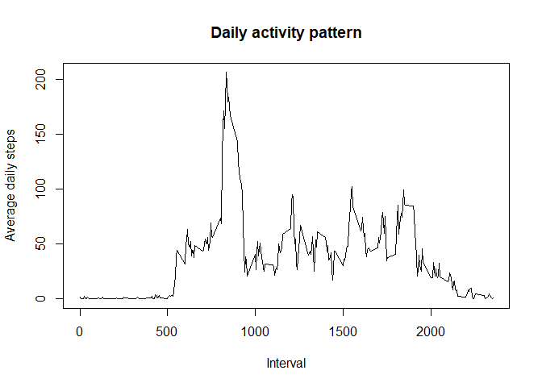

# Reproducible Research: Peer Assessment 1


## Loading and preprocessing the data

```r
actdata=read.csv("data/activity.csv",header=TRUE)
dailysteps<-aggregate(steps~date,data=actdata,sum,na.rm=TRUE)
```

## What is mean total number of steps taken per day?

```r
png("hist1.png", width=480, height=480)
print(hist(dailysteps$steps,main="Steps taken per day",xlab="Daily Steps",ylab="Frequency"))
meanstepsperday <- mean(dailysteps$steps)
medianstepsperday <- median(dailysteps$steps)
abline(v=meanstepsperday,col="red")
abline(v=medianstepsperday,col="blue")
legend('topright',col=c("red","blue"),legend=c("Mean","Median"),lty=1)
dev.off()
```

```r
paste("Mean is ", meanstepsperday)
```

```
## [1] "Mean is  10766.1886792453"
```

```r
paste("Median is ", medianstepsperday)
```

```
## [1] "Median is  10765"
```
## What is the average daily activity pattern?

```r
dailysteps<-aggregate(steps~interval,data=actdata,mean,na.rm=TRUE)
plot(steps~interval,data=dailysteps,type="l",main="Daily activity pattern",xlab="Interval",ylab="Average daily steps")
```

<!-- -->

```r
print(dailysteps[which.max(dailysteps$steps),]$interval)
```

```
## [1] 835
```
## Imputing missing values

```r
print(sum(is.na(actdata$steps)))
```

```
## [1] 2304
```

```r
mean(subset(actdata,actdata$date=='2012-10-02' &  actdata$steps>0)$steps,na.rm=TRUE)
```

```
## [1] 63
```
## Are there differences in activity patterns between weekdays and weekends?

